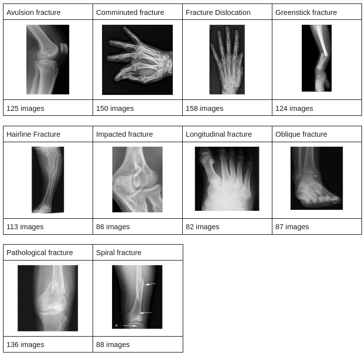

# Bone Fracture Classification

The bone fracture classification dataset consists of a collection of X-ray images capturing different types of bone breaks. The images cover a range of ten different bone fracture classes. The intent of this project is to classify each X-ray image into one of these ten bone fracture categories. Table 1 shows an example image for each class of bone fracture as well as the number of images in the dataset associated with that fracture class.

The images in this dataset are not restricted to a specific region of the body, as is clearly demonstrated in Table 1. There is also significant variation in the size of the images. For instance, some images are as small as 77x125, whereas others are as large as 640x640. Additionally, the orientation of each image is not standardized. This is demonstrated in Table 1 when looking at the example images for comminuted fracture and fracture dislocation. Both are X-ray images of bone fractures in the hand, but the hands are not oriented in the same direction. Finally, the images also exhibit varying intensities. Some X-ray images appear to have a very high contrast between the bone and background while others appear more muted.

Given the sample images in Table 1 and the nature of this task, we expect that the following features may be most useful:
- Edges: for detecting the outlines of the bones and different types of deviations from smooth lines (i.e. fractures)
- Histogram of Intensities: for detecting abrupt discontinuities in intensities that may be related to fractures

## Data Preprocessing and Feature Extraction
The following command line tool has been added for preprocessing and feature extraction:

### `run-data-pipeline`

Run using: `python main.py run-data-pipeline`

#### Arguments
- `--extract-hog` (default = True): Specify whether to extract HOG features.
- `--extract-canny-edges` (default = True): Specify whether to extract Canny Edges features.
- `--extract-contours` (default = True): Specify whether to extract Contours features.
